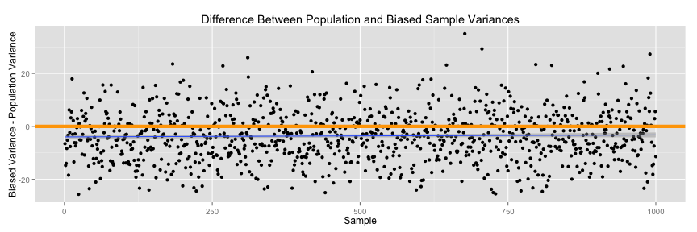

Developing Data Products Course Project
========================================================
author: Xing Su
date: February 19, 2015

Estimating Variance
========================================================
transition: rotate
**Variance** is a statistical measure of spread of a given distribution.

For a discrete variable $X$, variance is calculated by

$$\sigma^2 =\frac{1}{n}\sum_{i=1}^n (X_i - \bar X)^2$$

where $X_i$ represents the observations, $\bar X$ represents the mean, and $n$ represents number of observations.

Since we rarely know the population statistics and are often provided with only a sample, we can estimate it using the ~~sample statistics~~.

Why does dividing by n-1 make the estimator unbiased?
========================================================

There are **two** ways of estimating the population variance using a sample:

$$S^2_{unbiased} = \frac{\sum_{i=1}^n (X_i - \bar X)^2}{n-1} ~~~\mbox{and}~~~ S^2_{biased} = \frac{\sum_{i=1}^n (X_i - \bar X)^2}{n}$$

The **unbiased estimator** is more commonly used and is a ~~better~~ estimate. The only difference between the two calculations is the denominator--so ***why does dividing by $n-1$ make the estimator unbiased and better?***

To show this empirically, we will leverage a [Shiny Application](https://sxing.shinyapps.io/courseProject/) to simulate and analyze the variance estimates.

Shiny App
========================================================

The ~~Simulation Experiment~~ will perform the following:

<small>1. create a population distribution by drawing a number of observations from values 1 to 20</small>
<small>2. draw a number of samples of specified size from the population</small>
<small>3. compare the individual sample variances and the true population variance</small>
<small>4. show the effects of sample size vs accuracy of variance estimated</small>

The user will be able to control the **number of oberservations**, **number of samples**, and **sample size** to generate relevant plots using `ggplot2` and Google visualiztions.

Graphing Example
========================================================
**Google Visualization Plot Example from Shiny App:**
<!-- Histogram generated in R 3.1.2 by googleVis 0.5.8 package -->
<!-- Thu Feb 19 23:27:44 2015 -->

<!-- jsHeader -->

 
<!-- jsChart -->  

 
<!-- divChart -->
  

**`ggplot2` Plot Example from Shiny App:**
 

